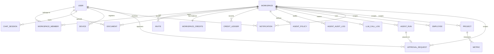

<!-- Sliced from the originating product's shared spec file, keeping only
     notification content. Commit lineage is the original file's; see
     PROVENANCE.md. Generated by notifslice.py -- do not hand-edit. -->

### User (K)

- `id`, `email` (unique), `password_hash`, `email_verified_at`, `mfa_enabled`, `created_at`, `updated_at`, `deleted_at`
- Rules: email unique; `email_verified_at` gates relaxed new-account budgets (FR-020).

### Invite (K)

- `id`, `workspace_id`, `email`, `role`, `clearance`/`access_level`, `token_hash`, `expires_at`, `accepted_at`, `created_by`

### Document (P)

- State transitions (ingestion status, tracked on the ingestion job / SSE, not necessarily a column): `received → converting → extracting_metadata → chunking → embedding → indexed` | `unsupported_type (501 stub)` | `rejected_oversize` | `dlq_parked` (embed-provider outage) | `failed`.

### Approval Request (K)

- `approval_request`: `id`, `workspace_id`, `user_id` (the approver/recipient), `kind` (`enrich_accept`|`long_horizon_action`|`sensitivity_confirm`|`web_search`|`note_edit`), `subject_type` (`note`|`agent_run_step`|`document`|`web_search`), `subject_id`, `prompt` TEXT (human-readable "what am I approving?"), `requested_payload` JSONB (draft ref / step description / suggested `access_level`), `status` (`pending`|`approved`|`rejected`|`expired`), `decision` JSONB (`{verdict: approve|reject|edit, resume_value, resolved_by, resolved_at, note}`), `resolved_by`, `resolved_at`, `idem_key`, `expires_at`, `created_at`. Constraints: **`UNIQUE(workspace_id, kind, subject_id) WHERE status='pending'`** (one live gate per subject) + **`UNIQUE(user_id, idem_key)`** (create idempotency); index `(user_id, status, created_at)` for the pending-inbox query.
- Rules: RLS restricts rows to `user_id = current_setting('app.user_id')::uuid` within `workspace_id` — a gate is visible/resolvable only by its approver, never another member or across workspaces even at L5 (FR-040, SC-014, parity with SC-012). **Fail-closed**: a `pending` gate never lets its action proceed; a scheduled sweep (`approval.expire.tick`) flips overdue `pending`→`expired`. Resolving is idempotent (first decision wins). The `decision` is **human-authored, never derived from model/tool/document output** (research §5, FR-011). **Zero credits** are spent and **no subject side effect** occurs while `pending` (refuse-before-spend, parity with the `guard` node). Every resolution writes an `audit_log` row (FR-023).

### Notifications (K)

- `notifications`: `id`, `workspace_id`, `user_id` (recipient), `category` (`ingestion_complete`|`ingestion_failed`|`invite_received`|`invite_accepted`|`invite_revoked`|`credit_warning`|`credit_exhausted`|`task_halted`|`approval_requested`|`doc_shared`|`clearance_changed`|`member_joined`|`admin_broadcast`), `priority` (`info`|`warning`|`critical`), `title`, `body`, `payload` JSONB (resource refs for deep-linking: `doc_id`/`invite_id`/`run_id`/`job_id`), `idem_key` (de-dupes redelivered/retried events), `read_at` (NULL = unread), `created_at`, `UNIQUE(user_id, idem_key)`
- `notification_outbox`: `id`, `notification_id` (FK → `notifications`), `workspace_id`, `channel` (`in_app`|`email`|…), `attempts` INT, `next_attempt_at`, `delivered_at` (NULL = pending), `last_error`, `created_at`. One row per enabled channel, **inserted in the same transaction as the `notifications` row** so a crash between persist and delivery cannot lose a channel send; drained at-least-once by the `Dispatcher` (see [notification-ports.md](./contracts/notification-ports.md), invariant 4). `UNIQUE(notification_id, channel)`. Index on `(delivered_at, next_attempt_at)` for the drain claim.
- `notification_preferences`: `id`, `user_id`, `workspace_id`, `category`, `in_app` BOOL, `email` BOOL, `UNIQUE(user_id, workspace_id, category)`
- `email_suppressions`: `id`, `email` (citext, `UNIQUE`), `reason` (`hard_bounce`|`complaint`|`unsubscribe`), `created_at` — addresses to which email is no longer sent (FR-035)
- Rules: RLS restricts `notifications` to `user_id = current_user` within `workspace_id` — a notification is never visible to any other member or across workspaces, even at L5 (FR-036, SC-012). The notification service applies `notification_preferences` before delivery; an absent preference row uses the category default (in-app on; email on for `credit_warning`, `credit_exhausted`, `invite_received`, `task_halted`, `approval_requested`, off otherwise — `approval_requested` defaults email-on because a paused agent action is actionable and time-sensitive) (FR-035). Delivery is idempotent: the persist step writes the `notifications` row **and one `notification_outbox` row per enabled channel in a single transaction**, so a redelivered/retried event is a no-op via the `(user_id, idem_key)` unique constraint (one row, one delivery per channel). The `SET NX notify:applied:{idem_key}` guard is only a fast pre-check that gates the durable write — **never** channel delivery, which is driven off the durable outbox at-least-once (each channel idempotent on `idem_key`) so a crash between persist and send cannot silently drop an email (FR-032, SC-013; [notification-ports.md](./contracts/notification-ports.md), invariants 3–4). High-volume same-category bursts for one recipient are coalesced into a digest/rate-limited summary rather than one push + one email per event (FR-038). The email worker skips any address present in `email_suppressions` and adds rows on provider bounce/complaint webhooks; unsubscribe links flip the relevant `notification_preferences.email` to false (FR-035). Retention: read notifications older than a configured window (default 90 days) are pruned/archived so inbox + unread-count stay performant; the table MAY be range-partitioned by `created_at` for cheap drop (FR-039). Index on `(user_id, read_at, created_at)` for inbox + unread-count queries.

### Supporting kernel tables

- `dead_letters` (K) — terminal store for poison messages that exhausted DLQ re-drive: `id`, `workspace_id`, `source_subject` (the originating work subject), `dlq_subject`, `payload` JSONB, `dlq_attempts`, `last_error`, `first_failed_at`, `dead_at`. RLS-scoped to `workspace_id`; admin-readable for inspection / manual replay. Written only by the DLQ sweeper once `dlq_attempts ≥ MAX_DLQ_ATTEMPTS` (default 5), which also emits a `dlq.dead.count` alert metric (research §18, FR-029/FR-035).

## Relationships (high level)

## Validation & invariants (test targets)

| A notification is visible only to its recipient, never to other members or across workspaces | SC-012 (blocker), FR-036 | `notifications` RLS (`user_id = current_user` within `workspace_id`) |
| A redelivered/retried event yields one notification, one delivery per channel | SC-013, FR-032 | `notifications.(user_id, idem_key) UNIQUE` + transactional `notification_outbox` (at-least-once drain, per-channel idempotent) + `SET NX` fast pre-check on the durable write only |
| Read notifications do not grow unbounded | FR-039 | Retention prune (default 90d) / range-partition drop on `created_at` |
| Email is not sent to a hard-bounced/complained/unsubscribed address | FR-035 | `email_suppressions` lookup in email worker + bounce/complaint webhook upsert |
| A DLQ-parked message is re-driven to its owning subject (reprocessed in the owning tier), not handled cross-tier in the sweeper | research §18 | DLQ sweeper re-publishes to the original work subject; owning worker idempotency |
| A poison message terminates in `dead_letters` after `MAX_DLQ_ATTEMPTS`, never re-driven forever | research §18 | DLQ sweeper attempt-cap + `dead_letters` write + `dlq.dead.count` alert |
