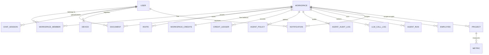

<!-- Sliced from the originating product's shared spec file, keeping only
     notification content. Commit lineage is the original file's; see
     PROVENANCE.md. Generated by notifslice.py -- do not hand-edit. -->

### User (K)

- `id`, `email` (unique), `password_hash`, `email_verified_at`, `mfa_enabled`, `created_at`, `updated_at`, `deleted_at`
- Rules: email unique; `email_verified_at` gates relaxed new-account budgets (FR-020).

### Invite (K)

- `id`, `workspace_id`, `email`, `role`, `clearance`/`access_level`, `token_hash`, `expires_at`, `accepted_at`, `created_by`

### Document (P)

- State transitions (ingestion status, tracked on the ingestion job / SSE, not necessarily a column): `received → converting → extracting_metadata → chunking → embedding → indexed` | `unsupported_type (501 stub)` | `rejected_oversize` | `dlq_parked` (embed-provider outage) | `failed`.

### Notifications (K)

- `notifications`: `id`, `workspace_id`, `user_id` (recipient), `category` (`ingestion_complete`|`ingestion_failed`|`invite_received`|`invite_accepted`|`invite_revoked`|`credit_warning`|`credit_exhausted`|`task_halted`|`doc_shared`|`clearance_changed`|`member_joined`|`admin_broadcast`), `priority` (`info`|`warning`|`critical`), `title`, `body`, `payload` JSONB (resource refs for deep-linking: `doc_id`/`invite_id`/`run_id`/`job_id`), `read_at` (NULL = unread), `created_at`
- `notification_preferences`: `id`, `user_id`, `workspace_id`, `category`, `in_app` BOOL, `email` BOOL, `UNIQUE(user_id, workspace_id, category)`
- Rules: RLS restricts `notifications` to `user_id = current_user` within `workspace_id` — a notification is never visible to any other member or across workspaces, even at L5 (FR-036, SC-012). The notification service applies `notification_preferences` before delivery; an absent preference row uses the category default (in-app on; email on for `credit_warning`, `credit_exhausted`, `invite_received`, `task_halted`, off otherwise) (FR-035). Index on `(user_id, read_at, created_at)` for inbox + unread-count queries.

## Relationships (high level)

## Validation & invariants (test targets)

| A notification is visible only to its recipient, never to other members or across workspaces | SC-012 (blocker), FR-036 | `notifications` RLS (`user_id = current_user` within `workspace_id`) |
